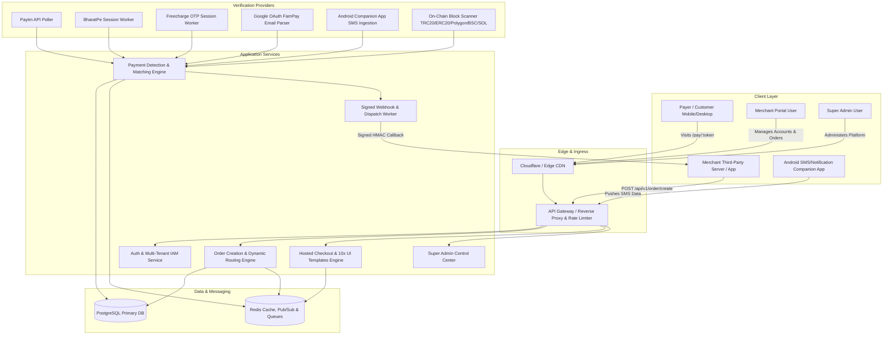

# Enterprise Multi-Tenant Payment Gateway & Management Platform
## Complete Architecture, Feature Breakdown & Replication Blueprint

---

### Executive Overview

This specification provides the complete technical architecture and implementation roadmap for building a next-generation, white-label, multi-tenant payment gateway platform (inspired by and extending beyond BlackPay / MXPay).

The platform operates on a **Direct-to-Merchant (P2M / P2P)** settlement model where merchants connect their own payment accounts (Paytm Business, BharatPe, FamPay, Freecharge, GPay Business, Mobikwik, Custom UPI via Android SMS Gateway, and Crypto USDT/USDC). Funds move directly from payers to the merchant's connected accounts with zero holding or gateway commission lockups, while the platform provides hosted checkout pages, dynamic QR codes, UPI app intents, real-time automated transaction matching, webhooks, analytics, and merchant/admin management.

---

## 1. System Architecture & Component Diagram



---

## 2. Core Modules & Feature Breakdown

### Module 1: Merchant & Payment Account Management
* **Supported Providers**:
  1. **Paytm Business**: Merchant ID (MID), Merchant Secret Key, Sub-account Token, UPI VPA (`merchant@paytm`). Uses official Paytm Order Status API for automated verification.
  2. **BharatPe Merchant**: Authenticated via mobile number + OTP login session; auto-syncs VPA (`merchant@yesbankltd`), merchant token, and live QR transaction feed.
  3. **FamPay**: Linked via Google OAuth (`gmail.readonly`) to parse instant "Payment Received" notification emails for amount and 12-digit UTR.
  4. **Freecharge Merchant**: Mobile + OTP session management with CSRF token generation and encrypted session cookies; matches order remarks & amounts.
  5. **Google Pay Business**: Custom merchant VPA (`merchant@okhdfcbank`) with intent trigger `tez://upi/pay`.
  6. **Mobikwik / Amazon Wallet**: VPA support (`merchant@ikwik`, `merchant@apl`).
  7. **Custom UPI + Android SMS Gateway**: Any standard UPI VPA (e.g. `shop@okaxis`, `personal@icici`). Paired with the native Android Companion App which forwards bank SMS in real-time.
  8. **Crypto (USDT / USDC)**: Multi-chain wallet configuration (TRC20, ERC20, Polygon, BSC, Solana) with on-chain transaction hash verification.
* **Traffic Routing & Load Balancing**:
  - **All Merchants (Auto-Rotate)**: Weighted random routing across all active accounts (e.g., Account A with weight 3 gets 75% traffic, Account B with weight 1 gets 25%).
  - **Provider-Scoped Rotation**: Rotates exclusively among accounts belonging to a specific provider (e.g., load-balance over 10 Paytm accounts).
  - **Single Fixed Account**: Routes 100% traffic to one chosen merchant account.
  - **Health Checks & Automatic Failover**: Automatically excludes paused, rate-limited, or session-expired accounts.

---

### Module 2: Hosted Checkout & Payment Page Engine
* **10 High-Converting UI Templates**:
  - `template_1` to `template_10` offering distinct layouts (Neumorphic, Glassmorphism, Dark Cyberpunk, Minimalist Clean, Card-Stack, Gradient Glow, Compact Modern, Trust-Badge Centric, Enterprise Corporate, and Animated Dynamic).
  - **Template Modes**: Fixed (pinned), Random (random selection per order), or Auto-Rotating (sequential rotation for A/B testing).
  - **Live Preview Studio**: `/preview/:templateId` enabling merchants to preview and test templates before going live.
  - **Branding Customization**: Custom business logo, brand accent color, store name, and support contact.
* **Checkout Features**:
  - **Dynamic UPI QR Code**: Real-time generated QR with standard URI:
    ```
    upi://pay?pa={upi_id}&pn={merchant_name}&am={amount}&tn={order_id}&cu=INR
    ```
  - **Deep-Link UPI Intent Buttons**: Direct launch for Google Pay, PhonePe, Paytm, CRED, BHIM, Amazon Pay, and default UPI selector.
  - **Live Polling & WebSockets**: Checks payment state every 2 seconds with clear status transitions (`PENDING` → `TXN_SUCCESS` / `AWAITING_VERIFY` / `FAILED` / `EXPIRED`).
  - **Manual UTR Submission**: Fallback input for customers to submit their 12-digit UTR/Reference ID if bank SMS/network is delayed.
  - **Embedded Self-Checkout SDK (`checkout.js`)**: Single-script popup/modal or redirect checkout for merchant web applications.
  - **Audio & Haptic Feedback**: Success sound effects, celebratory confetti, and automated redirect to merchant `return_url`.

---

### Module 3: Automated Payment Detection & Matching Engine
* **Paytm Direct API Worker**: Periodically queries Paytm transaction status endpoint using MID and order reference.
* **BharatPe Session Scanner**: Uses headless session tokens to fetch incoming settlement transactions and matches against open order windows.
* **Gmail OAuth Parser (FamPay)**:
  - Scans user mailbox only during active order windows for `from:alerts@fampay.in` or similar sender.
  - Extracts payment amount and UTR using strict regex rules.
* **Android Companion App SMS Gateway**:
  - Installed on merchant's Android phone.
  - Listens to incoming SMS from bank sender headers (e.g., `AD-HDFCBK`, `VK-SBIINB`, `BP-ICICIB`, `PAYTMB`).
  - Parses credit messages: `Credited by INR (\d+\.?\d*) ... UTR (\d{12})`.
  - Pushes payload to `/api/v1/sms/ingest` with device authentication token.
  - Matches against pending orders within valid timestamp windows (±10 minutes).
* **Crypto Block Scanner**:
  - Listens for transfer events (`Transfer(address,address,uint256)`) on USDT/USDC contracts across TRC-20, Polygon, BSC, and Ethereum.
  - Matches exact received amounts or customer-submitted transaction hashes.

---

### Module 4: Multi-User / Multi-Tenant SaaS & Merchant Portal
* **Authentication & IAM**:
  - Email/Password login, JWT session management, Password reset via email, 2FA (TOTP / Google Authenticator).
  - Role-Based Access Control (Super Admin, Merchant Admin, Sub-Account / Team Member).
* **Merchant Dashboard UI**:
  - **Live Overview**: Today's Volume, Total Revenue, Success Rate %, Active Merchants, Orders Today chart, Real-time transaction feed.
  - **Orders Explorer**: Search, multi-criteria filters (date range, provider, status, UTR, order ID), manual transaction verification, CSV/Excel export.
  - **Merchant Accounts**: Add, configure, test, pause/resume, delete accounts, configure weights, connect Gmail OAuth, Freecharge/BharatPe OTP login, pair companion phone.
  - **API Keys & Webhooks**: Create scoped keys (Global, Provider, Account), select default template, configure Webhook URL, generate HMAC secret, view delivery logs, test replay.
  - **Payment Page Settings**: Configure template mode, select default templates, set custom branding, view per-template conversion rate analytics.
  - **Plans & Billing**: View current plan tier, daily order quota, merchant account limits, API key limits, renew/upgrade plan, view invoice history.

---

### Module 5: Super Admin Control Center
* **Platform Overview**: Global transaction volume, platform-wide success rates, active merchant counts, server health, queue latencies.
* **Merchant & User Directory**: View all registered businesses, inspect individual account usage, suspend/ban users, masquerade/login-as user for debugging.
* **Global Orders Firehose**: Live cross-merchant order audit, UTR lookup tool, force status overrides (mark paid/cancelled).
* **Plan & Subscription Manager**: Define custom plans (Price, Validity Days, Max Merchant Accounts, Max Orders/Day, Max API Keys, Priority Webhooks).
* **System Logs & Webhook Monitor**: Inspect failed webhook deliveries, gateway provider health, and background worker queues.

---

### Module 6: Android Companion App (Kotlin / Flutter)
* **Foreground Service**: Persistent background service with wake-lock and low battery consumption.
* **Notification Listener (`NotificationListenerService`)**: Intercepts UPI push notifications from Paytm, PhonePe, BharatPe, GPay, and bank apps.
* **SMS Broadcast Receiver (`SMS_RECEIVED`)**: Intercepts incoming credit SMS.
* **Regex Engine**: Extensible regex dictionary for 50+ Indian banks.
* **Offline Resiliency**: Local SQLite queue with auto-retry and exponential backoff when network connectivity drops.
* **Heartbeat & Device Pairing**: QR code pairing to merchant workspace with periodic ping every 60 seconds to display live device status on web panel.

---

## 3. Production Database Schema (PostgreSQL DDL)

```sql
-- Enable UUID and Cryptographic extensions
CREATE EXTENSION IF NOT EXISTS "uuid-ossp";
CREATE EXTENSION IF NOT EXISTS "pgcrypto";

-- 1. Organizations / Tenants
CREATE TABLE tenants (
    id UUID PRIMARY KEY DEFAULT gen_random_uuid(),
    name VARCHAR(255) NOT NULL,
    email VARCHAR(255) UNIQUE NOT NULL,
    password_hash VARCHAR(255) NOT NULL,
    role VARCHAR(50) DEFAULT 'MERCHANT', -- 'SUPER_ADMIN', 'MERCHANT', 'OPERATOR'
    business_name VARCHAR(255),
    is_active BOOLEAN DEFAULT TRUE,
    created_at TIMESTAMP WITH TIME ZONE DEFAULT CURRENT_TIMESTAMP,
    updated_at TIMESTAMP WITH TIME ZONE DEFAULT CURRENT_TIMESTAMP
);

-- 2. Subscription Plans
CREATE TABLE plans (
    id UUID PRIMARY KEY DEFAULT gen_random_uuid(),
    name VARCHAR(100) NOT NULL,
    price DECIMAL(10, 2) DEFAULT 0.00,
    validity_days INT DEFAULT 30,
    max_merchant_accounts INT DEFAULT 5,
    max_orders_per_day INT DEFAULT 500,
    max_api_keys INT DEFAULT 3,
    features JSONB DEFAULT '{"webhooks": true, "sms_gateway": true, "crypto": false}',
    is_active BOOLEAN DEFAULT TRUE,
    created_at TIMESTAMP WITH TIME ZONE DEFAULT CURRENT_TIMESTAMP
);

-- 3. Tenant Subscriptions
CREATE TABLE tenant_subscriptions (
    id UUID PRIMARY KEY DEFAULT gen_random_uuid(),
    tenant_id UUID REFERENCES tenants(id) ON DELETE CASCADE,
    plan_id UUID REFERENCES plans(id),
    status VARCHAR(50) DEFAULT 'ACTIVE', -- 'ACTIVE', 'EXPIRED', 'CANCELLED'
    starts_at TIMESTAMP WITH TIME ZONE DEFAULT CURRENT_TIMESTAMP,
    expires_at TIMESTAMP WITH TIME ZONE NOT NULL,
    created_at TIMESTAMP WITH TIME ZONE DEFAULT CURRENT_TIMESTAMP
);

-- 4. Connected Merchant Accounts
CREATE TABLE merchant_accounts (
    id UUID PRIMARY KEY DEFAULT gen_random_uuid(),
    tenant_id UUID REFERENCES tenants(id) ON DELETE CASCADE,
    provider VARCHAR(50) NOT NULL, -- 'PAYTM', 'BHARATPE', 'FAMPAY', 'FREECHARGE', 'CUSTOM_UPI', 'CRYPTO', 'GPAY_BUSINESS'
    label VARCHAR(100) NOT NULL,
    upi_id VARCHAR(255),
    display_name VARCHAR(255),
    weight INT DEFAULT 1,
    status VARCHAR(50) DEFAULT 'ACTIVE', -- 'ACTIVE', 'PAUSED', 'EXPIRED', 'ERROR'
    intent_enabled BOOLEAN DEFAULT TRUE,
    credentials_encrypted JSONB DEFAULT '{}', -- Encrypted tokens, cookies, MIDs, API secrets
    gmail_connected BOOLEAN DEFAULT FALSE,
    gmail_refresh_token VARCHAR(500),
    last_used_at TIMESTAMP WITH TIME ZONE,
    created_at TIMESTAMP WITH TIME ZONE DEFAULT CURRENT_TIMESTAMP,
    updated_at TIMESTAMP WITH TIME ZONE DEFAULT CURRENT_TIMESTAMP
);

-- 5. Paired SMS / Companion Devices
CREATE TABLE paired_devices (
    id UUID PRIMARY KEY DEFAULT gen_random_uuid(),
    tenant_id UUID REFERENCES tenants(id) ON DELETE CASCADE,
    device_name VARCHAR(100) NOT NULL,
    device_token VARCHAR(255) UNIQUE NOT NULL,
    sim_slots JSONB DEFAULT '[]',
    battery_level INT,
    is_online BOOLEAN DEFAULT FALSE,
    last_heartbeat_at TIMESTAMP WITH TIME ZONE,
    created_at TIMESTAMP WITH TIME ZONE DEFAULT CURRENT_TIMESTAMP
);

-- 6. API Keys
CREATE TABLE api_keys (
    id UUID PRIMARY KEY DEFAULT gen_random_uuid(),
    tenant_id UUID REFERENCES tenants(id) ON DELETE CASCADE,
    name VARCHAR(100) NOT NULL,
    key_prefix VARCHAR(16) NOT NULL,
    key_hash VARCHAR(255) NOT NULL,
    scope VARCHAR(50) DEFAULT 'ALL', -- 'ALL', 'PROVIDER', 'ACCOUNT'
    provider_filter VARCHAR(50),
    merchant_account_id UUID REFERENCES merchant_accounts(id) ON DELETE SET NULL,
    pinned_template VARCHAR(50), -- e.g., 'template_1', 'random', or NULL
    webhook_url VARCHAR(500),
    webhook_secret VARCHAR(255),
    ip_whitelist TEXT[], -- e.g. ['192.168.1.1', '10.0.0.0/24']
    is_active BOOLEAN DEFAULT TRUE,
    last_used_at TIMESTAMP WITH TIME ZONE,
    created_at TIMESTAMP WITH TIME ZONE DEFAULT CURRENT_TIMESTAMP
);

-- 7. Payment Orders
CREATE TABLE orders (
    id UUID PRIMARY KEY DEFAULT gen_random_uuid(),
    order_id VARCHAR(64) UNIQUE NOT NULL, -- Public order reference e.g., 'ORD_892348123'
    tenant_id UUID REFERENCES tenants(id) ON DELETE CASCADE,
    api_key_id UUID REFERENCES api_keys(id) ON DELETE SET NULL,
    merchant_account_id UUID REFERENCES merchant_accounts(id) ON DELETE SET NULL,
    amount DECIMAL(12, 2) NOT NULL,
    currency VARCHAR(10) DEFAULT 'INR',
    customer_mobile VARCHAR(20),
    customer_name VARCHAR(100),
    customer_email VARCHAR(255),
    remark1 VARCHAR(255),
    remark2 VARCHAR(255),
    return_url VARCHAR(500),
    callback_url VARCHAR(500),
    template VARCHAR(50) DEFAULT 'template_1',
    link_token VARCHAR(64) UNIQUE NOT NULL,
    
    -- Status & Detection
    status VARCHAR(50) DEFAULT 'PENDING', -- 'PENDING', 'AWAITING_VERIFY', 'TXN_SUCCESS', 'FAILED', 'EXPIRED', 'CANCELLED'
    utr VARCHAR(64),
    gateway_txn_id VARCHAR(255),
    payer_vpa VARCHAR(255),
    raw_verification_data JSONB,
    
    paid_at TIMESTAMP WITH TIME ZONE,
    expires_at TIMESTAMP WITH TIME ZONE NOT NULL,
    created_at TIMESTAMP WITH TIME ZONE DEFAULT CURRENT_TIMESTAMP,
    updated_at TIMESTAMP WITH TIME ZONE DEFAULT CURRENT_TIMESTAMP
);

-- Indexes for lightning fast queries
CREATE INDEX idx_orders_tenant_status ON orders(tenant_id, status);
CREATE INDEX idx_orders_link_token ON orders(link_token);
CREATE INDEX idx_orders_utr ON orders(utr);
CREATE INDEX idx_orders_expires_at ON orders(expires_at);

-- 8. Webhook Delivery Logs
CREATE TABLE webhook_logs (
    id UUID PRIMARY KEY DEFAULT gen_random_uuid(),
    order_id UUID REFERENCES orders(id) ON DELETE CASCADE,
    tenant_id UUID REFERENCES tenants(id) ON DELETE CASCADE,
    target_url VARCHAR(500) NOT NULL,
    payload JSONB NOT NULL,
    response_code INT,
    response_body TEXT,
    attempt_count INT DEFAULT 1,
    status VARCHAR(50) DEFAULT 'DELIVERED', -- 'DELIVERED', 'FAILED', 'RETRYING'
    created_at TIMESTAMP WITH TIME ZONE DEFAULT CURRENT_TIMESTAMP
);
```

---

## 4. REST API Specification

### 4.1 Order Creation Endpoint
* **Method**: `POST /api/public/v1/order/create`
* **Headers**: `x-api-key: <MERCHANT_API_KEY>`, `Content-Type: application/json`
* **Request Body**:
```json
{
  "amount": 499.00,
  "customer_mobile": "9876543210",
  "customer_name": "Rahul Sharma",
  "customer_email": "rahul@example.com",
  "remark1": "inv_9042",
  "return_url": "https://merchant-store.com/checkout/success"
}
```
* **Response Body**:
```json
{
  "status": true,
  "data": {
    "order_id": "ORD_7812904123",
    "provider": "PAYTM",
    "merchant_account_id": "9b1deb4d-3b7d-4bad-9bdd-2b0d7b3dcb6d",
    "account_label": "Main Store Paytm",
    "amount": 499.00,
    "template": "template_4",
    "payment_url": "https://yourgateway.domain/pay/a8f9b7c6d5e4",
    "link_token": "a8f9b7c6d5e4",
    "expires_at": "2026-09-11T16:00:00.000Z"
  }
}
```

---

### 4.2 Order Status Query Endpoint
* **Method**: `POST /api/public/v1/order/status` or `GET /api/public/v1/order/status?order_id=ORD_7812904123`
* **Headers**: `x-api-key: <MERCHANT_API_KEY>`
* **Response Body**:
```json
{
  "status": true,
  "data": {
    "order_id": "ORD_7812904123",
    "provider": "PAYTM",
    "amount": 499.00,
    "txn_status": "TXN_SUCCESS",
    "utr": "412398457612",
    "gateway_txn": "20260911111212800110168923",
    "paid_at": "2026-09-11T15:52:14.000Z",
    "expires_at": "2026-09-11T16:00:00.000Z",
    "payment_url": "https://yourgateway.domain/pay/a8f9b7c6d5e4"
  }
}
```

---

### 4.3 Webhook Payload & Signature Verification
* **Method**: `POST {merchant_webhook_url}`
* **Headers**:
  - `x-gateway-signature: sha256={HMAC_SHA256(payload, webhook_secret)}`
  - `Content-Type: application/json`
* **Payload**:
```json
{
  "event": "payment.success",
  "order_id": "ORD_7812904123",
  "amount": 499.00,
  "currency": "INR",
  "status": "TXN_SUCCESS",
  "utr": "412398457612",
  "paid_at": "2026-09-11T15:52:14.000Z",
  "custom_data": {
    "remark1": "inv_9042"
  }
}
```

---

## 5. Technology Stack Recommendation

| Layer | Technology | Rationale |
| :--- | :--- | :--- |
| **Backend & APIs** | **Node.js (TypeScript) + Fastify / NestJS** or **Go (Golang)** | High-throughput async I/O, low latency for order routing and webhook dispatching. |
| **Database** | **PostgreSQL (v15+)** | ACID compliance, JSONB support for credential storage, reliable indexing. |
| **Caching & Queues** | **Redis + BullMQ** | Sub-millisecond polling cache, distributed locks for UTR deduplication, robust retry queues for webhooks. |
| **Merchant & Admin Frontend** | **Next.js 14 / Vite + React + Tailwind CSS + Lucide** | Modern dashboard, glassmorphism UI, server-side rendering for checkout pages. |
| **Mobile Companion App** | **Flutter / Native Android Kotlin** | Reliable `NotificationListenerService` and `SMS_RECEIVED` broadcast receiver handling. |
| **Infrastructure & Security** | **Docker + Nginx / Traefik + Cloudflare** | DDoS protection, TLS 1.3, rate limiting, AES-256-GCM encryption for stored tokens. |
